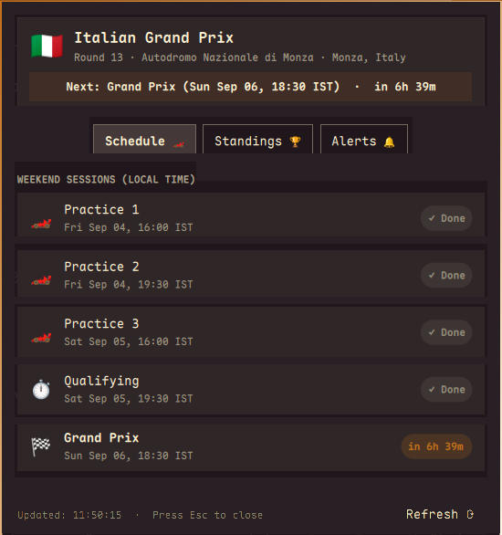
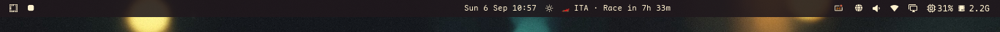
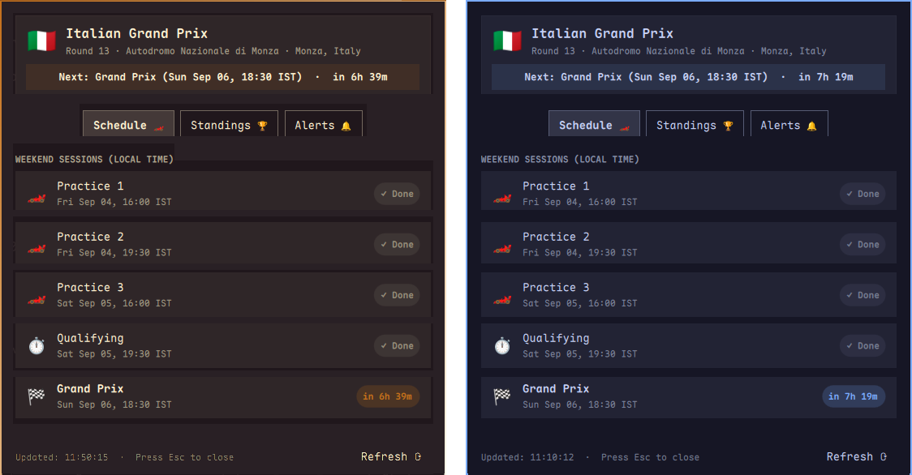
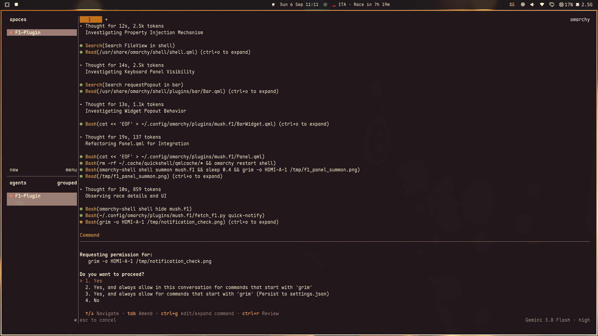
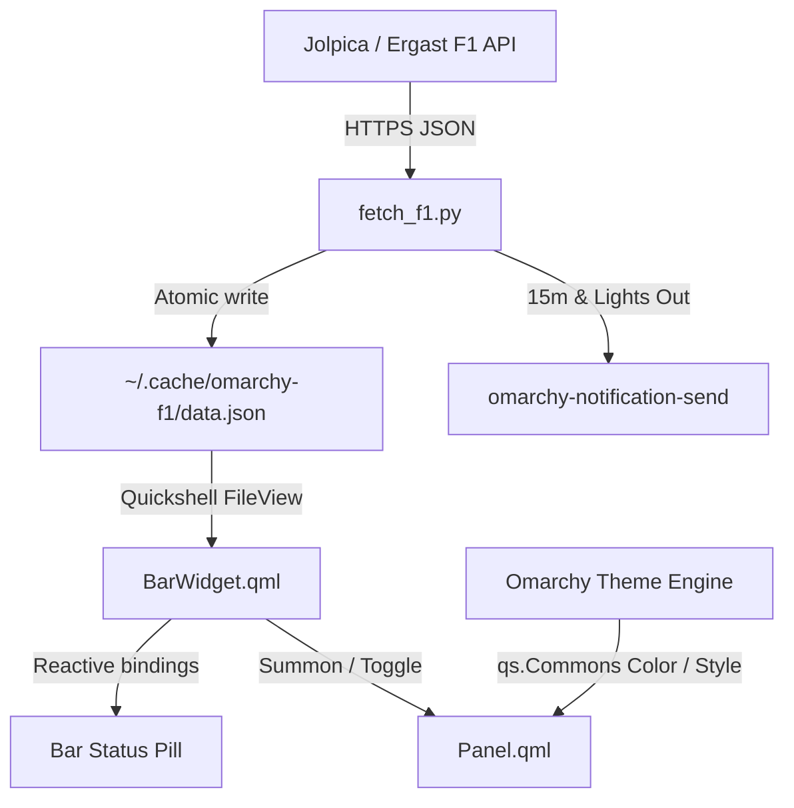

<div align="center">

# 🏎️ Omarchy F1 Hub

**A macOS-inspired Formula 1 status bar widget and popout dashboard for Omarchy Linux.**

[](https://omarchy.org/)
[](https://hyprland.org/)
[](https://api.jolpi.ca/)
[](LICENSE)
[](https://python.org/)

<br />

[Features](#-features) • [Showcase](#-showcase) • [Quick Install](#-installation) • [Controls & Shortcuts](#-controls--shortcuts) • [Adaptive Theming](#-adaptive-theming) • [Architecture](#-architecture) • [License](#-license)

<br />



</div>

---

## 🌟 Overview

**Omarchy F1 Hub** brings the fluid, native feel of macOS Formula 1 menu bar utilities (such as PitWall and Box Box Club) straight to your Arch / Omarchy desktop powered by **Quickshell** and **Hyprland**.

Get real-time countdowns on your top bar, local timetable schedules for every session across the race weekend, live Drivers and Constructors championship standings, desktop notifications before session green lights, and 100% reactive theme adaptation.

---

## ✨ Features

- ⏱️ **Live Bar Widget:**
  - Displays host country code, upcoming session name, and relative countdown (e.g. `🏎️ ITA · Race in 7h 14m`).
  - Automatically switches to a pulsing `🔴 LIVE · Race` badge whenever cars are out on track.
- 📅 **Grand Prix Weekend Schedule:**
  - Complete timetable of all weekend sessions (FP1, FP2, FP3, Qualifying, Sprint Shootout, Sprint, and Grand Prix).
  - Automatically converts all track UTC times to your system's **local timezone**.
  - Dynamic status tags (`Done`, `LIVE NOW`, countdown).
- 🏆 **Championship Standings:**
  - **Drivers:** Rank, podium medals (🥇🥈🥉), official team color accents, driver code, full name, constructor, championship points, and season wins.
  - **Constructors:** Rank, team livery color stripe, constructor name, points, and wins.
- 🔔 **Intelligent Desktop Notifications:**
  - Dispatches desktop alerts **15 minutes before** any session start.
  - Dispatches an instant **"Lights Out!"** notification the second a session goes live.
  - Anti-spam deduplication engine ensures you are never notified twice for the same event.
- 🎨 **100% Theme Adaptive:**
  - Built directly using Omarchy's native `qs.Commons` (`Color`, `Style`) and `qs.Ui` components.
  - Seamlessly updates backgrounds, card surfaces, borders, text colors, and highlights whenever you switch Omarchy themes.
- 🖱️ **Rich Mouse & Hotkey Controls:**
  - Left-Click, Right-Click, and Middle-Click quick actions.
  - Dedicated optional Hyprland hotkey (<kbd>SUPER</kbd> + <kbd>F1</kbd>) to toggle the hub from anywhere.

---

## 📸 Showcase

### Top Bar Status Widget
Compact, glanceable, and fits neatly into any bar section:
<div align="center">
  
</div>

<br />

### Popout F1 Hub Dashboard
One click opens a full-featured dashboard with hero card, local weekend timetable, and championship standings:
<div align="center">
  
</div>

<br />

### 🎨 Fully Adaptive Theming
No hardcoded hex values. Whether you run `Catppuccin`, `Tokyo Night`, `Waffle Cat`, `Gruvbox`, or `Nord`, every UI element adapts instantly:
<div align="center">
  
</div>

<br />

### 🔔 Desktop Notifications
Native Omarchy notifications using `omarchy-notification-send`:
<div align="center">
  
</div>

---

## 🚀 Installation

### Option 1: One-Line Install via Omarchy CLI (Recommended)

Run the following command in your terminal:

```bash
omarchy plugin add https://github.com/m7sh/omarchy-f1.git --enable
```

*Omarchy will automatically clone the repository, validate its manifest, and register the widget in your status bar.*

### Option 2: Manual Git Clone

```bash
# Clone into Omarchy plugins directory
git clone https://github.com/m7sh/omarchy-f1.git ~/.config/omarchy/plugins/mush.f1

# Rescan plugins and enable
omarchy-shell shell rescanPlugins
omarchy plugin enable mush.f1
```

---

## 🖱️ Controls & Shortcuts

| Action | Trigger | Description |
| :--- | :--- | :--- |
| **Toggle Hub** | Left-Click on Bar Pill | Opens or closes the F1 Hub popout panel |
| **Race Summary** | Right-Click on Bar Pill | Dispatches an instant notification with next session details |
| **Force Refresh** | Middle-Click on Bar Pill | Manually queries the Jolpica API for updated data |
| **Close Hub** | <kbd>Esc</kbd> / Click outside | Dismisses the popup panel |
| **Toggle Shortcut** | <kbd>SUPER</kbd> + <kbd>F1</kbd> | Toggle the dashboard from anywhere with your keyboard |

### Enabling the Hyprland Keyboard Shortcut

To enable <kbd>SUPER</kbd> + <kbd>F1</kbd>, add the following line to `~/.config/hypr/bindings.lua`:

```lua
o.bind("SUPER + F1", "F1 Hub", "omarchy-shell shell toggle mush.f1")
```

Then reload Hyprland to apply the change:
```bash
hyprctl reload
```

---

## 📂 Project Structure

```
~/.config/omarchy/plugins/mush.f1/
├── manifest.json       # Omarchy v1 plugin registration & bar widget schema
├── BarWidget.qml       # Quickshell top bar status pill
├── Panel.qml           # Quickshell popup hub (Hero, Schedule, Standings, Alerts)
├── fetch_f1.py         # Python engine: Jolpica API client & notification dispatcher
├── preview.png         # Gallery preview thumbnail
├── assets/             # Screenshots and visual media
├── LICENSE             # MIT License
└── README.md           # Documentation
```

### Runtime State & Cache
- **`~/.cache/omarchy-f1/data.json`**: Cached weekend timetable, session countdowns, and championship standings.
- **`~/.cache/omarchy-f1/notified.json`**: Notification deduplication state to prevent repeated alerts.
- **`~/.config/omarchy/settings/f1.json`**: User preferences (e.g. notifications toggle).

---

## 🏗️ Architecture



1. **Jolpica / Ergast API:** Fetches next Grand Prix, session schedules, and championship standings over HTTPS.
2. **Local Caching & Offline Resilience:** Data is atomically cached to `~/.cache/omarchy-f1/data.json`. The widget loads instantly without blocking the desktop or UI thread.
3. **Reactive UI:** Built on Quickshell's reactive QML engine. UI properties update immediately when data refreshes or when desktop themes change.
4. **Desktop Notifications:** Scheduled checks trigger alerts 15 minutes before sessions and at race start, recording timestamps in a deduplication ledger.

---

## 🔄 Updating the Plugin

To pull the latest updates and improvements:

```bash
omarchy plugin update mush.f1
```

---

## 🌐 Data Sources & Acknowledgments

- Powered by the free and community-maintained [Jolpica F1 API](https://api.jolpi.ca/) (successor to the Ergast Developer API).
- Designed for the [Omarchy](https://omarchy.org/) Linux desktop environment.
- *Disclaimer: This project is an unofficial open-source utility and is not affiliated, associated, authorized, endorsed by, or in any way officially connected with Formula 1, FIA, or any of its subsidiaries.*

---

## 📜 License

This project is licensed under the [MIT License](LICENSE).
